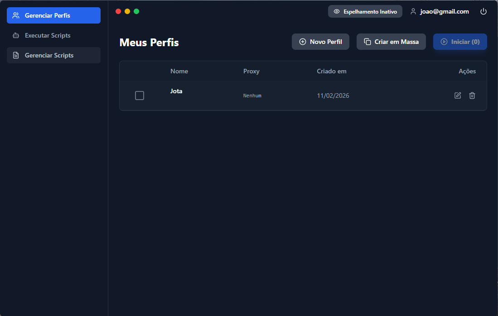

# 🛡️ Easy Sprint - AntiDetect Browser Engine



Este repositório apresenta a documentação técnica e a arquitetura de um navegador focado em privacidade e automação de alta performance. Desenvolvido com **Electron**, **React** e **Node.js**, o projeto é uma solução robusta para gerenciamento de múltiplas identidades digitais, garantindo isolamento total de perfis e evasão de sistemas de rastreamento.

> **Nota:** Este é um repositório de portfólio. O código-fonte é mantido de forma privada para fins comerciais e proteção de propriedade intelectual.

---

## 🚀 Funcionalidades de Destaque

### 🪞 Modo Espelho (Action Mirroring)
Uma das funcionalidades mais avançadas do motor, permitindo a sincronização em tempo real entre instâncias.
* **Replicação de Eventos:** Cliques, digitação e rolagem realizados em uma "Janela Mestre" são transmitidos instantaneamente para todas as outras janelas ativas.
* **Cálculo de Coordenadas:** O sistema utiliza lógica de coordenadas relativas para garantir que as ações sejam precisas, independentemente da resolução da janela.

### 🤖 Painel de Automação e Injeção de Scripts
Interface dedicada para produtividade em escala.
* **Injeção Dinâmica:** Permite injetar fragmentos de código JavaScript em ambientes isolados via `preload scripts`.
* **Execução em Massa:** Possibilidade de executar automações simultâneas em centenas de perfis sem detecção por sistemas anti-bot.

### 🌍 Gerenciamento de Localização e Geo-Spoofing
Controle granular sobre como o navegador é percebido geograficamente:
* **Timezone & Locale:** Ajuste automático de fuso horário e idioma baseado no Proxy.
* **Geolocalização:** Sobrescrita de Latitude e Longitude via protocolo de depuração para máxima precisão regional.

---

## 🛠️ Arquitetura Técnica

O software utiliza uma arquitetura baseada em eventos para mediar a comunicação entre o processo principal do Electron e os múltiplos processos de renderização.

```mermaid
sequenceDiagram
    participant U as Usuário (Janela Mestre)
    participant R as Processo de Renderização
    participant M as Processo Principal (Electron)
    participant S as Janelas Escravas (Perfis 1..N)

    U->>R: Realiza Ação (Clique/Teclado)
    R->>M: Envia Evento via IPC
    Note over M: Cálculo de Coordenadas Relativas
    M-->>S: Broadcast do Evento (Sincronização)
    Note over S: Execução Simultânea
